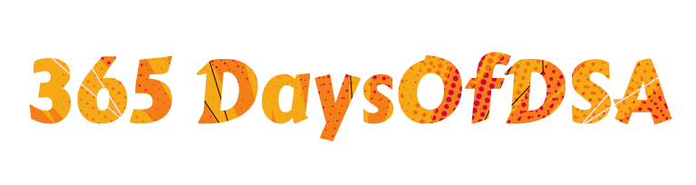

<div align="center">

  
  
  <p>
    Get Job Ready with 90 Leetcode Problems!  
  </p>
  <p>
    Starting Soon On <a href="https://www.youtube.com/introvertCoder">My Youtube Channel</a> !
  </p>
  <p>
    A <a href="https://codecolts.vercel.app/">CodeColts</a> Project
  </p>

  
<!-- Badges -->
<p>
  <a href="https://github.com/codeintrovert/90DaysOfDSA/graphs/contributors">
    
  </a>
  <a href="https://github.com/codeintrovert/90DaysOfDSA/commits/main">
    
  </a>
  <a href="https://github.com/codeintrovert/90DaysOfDSA/network/members">
    
  </a>
  <a href="https://github.com/codeintrovert/90DaysOfDSA/stargazers">
    
  </a>
<a rel="license" href="http://creativecommons.org/licenses/by-nc-nd/4.0/"></a>

[](https://www.youtube.com/introvertCoder/)
</p>
   
<h4>
    <a href="https://github.com/codeIntrovert/90daysOfDSA/tree/main/src">View Code</a>
  <span> · </span>
    <a href="https://github.com/codeIntrovert/90daysOfDSA/blob/main/README.md">Documentation</a>
  <span> · </span>
    <a href="https://github.com/codeintrovert/90DaysOfDSAe/issues/">Report Bug</a>
  <span> · </span>
    <a href="https://github.com/codeintrovert/90DaysOfDSA/issues/">Request Feature</a>
  </h4>
</div>

<br />

<!-- About the Project -->
## :star2: About the Project

<div align="center"> 
  Welcome to the "90 Days of DSA" repository! 🎉 This is your one-stop destination for daily coding practice with Data Structures and Algorithms (DSA) problems. Whether you are preparing for technical interviews or just looking to enhance your problem-solving skills, we've got you covered!
  
  <hr>
  


</div>

## 📅 Daily Challenge

Each day, we'll release a new DSA problem along with its solution. You can use this repository to:

- 🧠 Learn and understand various DSA concepts.
- 💻 Implement solutions in Java.
- 🚀 Sharpen your problem-solving skills.

Feel free to contribute your own solutions or improve existing ones! Let's learn and grow together as a community.

## 🛠️ Getting Started

1. Clone the repository to your local machine:

```bash
git clone https://github.com/codeintrovert/90DaysOfDSA
```
2. Navigate to the `src` folder
```bash 
cd ./90DaysOfDSA/src
```

<!-- TechStack -->
## :space_invader: Tech Stack


  - Java 
  - TypeScript 
  - Python 


<!-- Usage -->
## :eyes: Live Project Coming Soon! 
<ul><li>
<a href="https://youtube.com/introvertCoder">Youtube Series Starting Soon!</a>
</li>
<li>
<a href="https://codecolts.vercel.app/">CodeColts</a>
</li>
</ul>

<!-- Roadmap -->
## :compass: Roadmap
- Video Series Comming Soon!
* [x] 10 Days Problem Solving Streak
* [x] 20 Days Problem Solving Streak
* [ ] 40 Days Problem Solving Streak
* [ ] 60 Days Problem Solving Streak
* [ ] 90 Days Problem Solving Streak


<!-- Contributing -->
## 🤝 Contributing

<a href="https://github.com/codeintrovert/90DaysOfDSA/graphs/contributors">
  
</a>


Contributions are welcome and encouraged! Whether you find a bug, have a suggestion, or want to add your own solution, please follow the [contribution guidelines](https://github.com/codeIntrovert/90daysOfDSA/blob/main/CONTRIBUTING.md)


<!-- License -->
## :warning: License

The materials herein are all &copy; 2023 Hasan Imam.

<a rel="license" href="http://creativecommons.org/licenses/by-nc-nd/4.0/"></a><br />This work is licensed under a <a rel="license" href="http://creativecommons.org/licenses/by-nc-nd/4.0/">Creative Commons Attribution-NonCommercial-NoDerivs 4.0 Unported License</a>.


<!-- Contact -->
## :handshake: Contact

Hasan Imam

Email: codeColts@gmail.com
Instagram: [@introvertCoder](https://instagram.com/introvertcoder)
Youtube: [@introvertcoder](https://www.youtube.com/introvertCoder)
Discord: introvertCoder

[](https://www.youtube.com/introvertCoder/)

<!-- Acknowledgments -->
## :gem: Acknowledgements

 - [LeetCode](https://leetcode.com/)
 - [CodeColts](https://codecolts.vercel.app/)
 - [Shields.io](https://shields.io/)
 - [Awesome README](https://github.com/matiassingers/awesome-readme)
